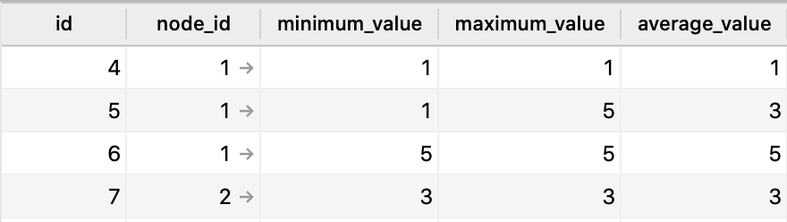

# Simple Data Stream Analytics

## Table of Contents
  * [Description](#description)
    * [Technologies](#technologies)
  * [Installation](#installation)
    * [Setting up the application](#setting-up-the-application)
    * [Running the application](#running-the-application)
  * [Testing](#testing)
    * [Unit Tests](#unit-tests)
    * [Feature Tests](#feature-tests)
  * [Process](#process)
  * [Design](#design)
    * [Objects](#objects)
    * [Edge Cases](#edge-cases)

## Description
A simple data stream analytics microservice built with Rails and a Kafka Consumer group that listens to a Kafka queue, dequeues messages, and processes them to calculate the minimum value, maximum value, and average value for each node, per minute. These statistics are then saved to a Postgres database. The Kafka Consumer service is built with Racecar, a gem that is based on Ruby-Kafka and integrates Kafka with Rails. 

### Technologies

- Languages: Ruby
- Frameworks: Rails
- Testing: RSpec, SimpleCov
- Linting: Rubocop
- Database: PostgreSQL, TablePlus
- Containerisation: Docker
- Stream Processing: Zookeeper, Apache Kafka, Ruby-Kafka, Racecar

**Kafka**

Kafka was chosen as a technology because it provides a reliable way to scale a service if it must consume large numbers of incoming data. It guarantee some reliability by enqueuing and dequeueing the data.

**Rails** 

Rails was chosen simply because it is the framework I know the best, and Ruby is the language that I am most comfortable with.

## Installation

### Setting up the application

Set up the Docker container locally:

```
git clone https://github.com/nikimanoledaki/data_stream_analytics.git
cd data_stream_analytics
docker-compose build
docker-compose run web bundle exec rake db:create db:migrate
```

### Running the application

At this moment the application can listen for a local Zookeeper/Kafka queue on port `9092`. Adding a Zookeeper/Kafka service to this Docker was fine, but there was a network error because the Consumer was refused access to port `9092`. This could be resolved with additional time.

**Option 1: Rails console**

As an alternative to this, running the application's features can be tested through the use of the Rails console. These are similar to the feature tests in /spec/features/new_message_and_node_statistic_spec.rb.

Start the Rails console:
```
docker-compose run --rm web rails console

# require files 
require './app/consumers/node_data_consumer.rb'
Dir["./lib/*.rb"].each {|file| require file }
require './app/models/node.rb'
require './app/models/statistic.rb'

message1 = JSON.generate({ "value": {"node_id": "9223372036854775807", "value": 1, "timestamp": "2020-01-03T01:19:13 -01:00"}})
message2 = JSON.generate({ "value": {"node_id": "9223372036854775807", "value": 5, "timestamp": "2020-01-03T01:19:13 -01:00"}})
consumer = NodeDataConsumer.new
consumer.process(message1)
consumer.process(message2)
```

**Option 2: Set up Zookeeper/Kafka**

To set up a Zookeeper/Kafka server locally is the best way to use the application right now. 

This requires the following (versioning may vary but these ones work):
- Java SDK 8
- Apache Zookeeper (>= 3.4)
- Apache Kafka 2.4.1

The steps to follow:
```
cd kafka_2.12-2.4.1
.bin/zookeeper-server-start.sh config/zookeeper.properties
```

In a new terminal:
```
cd kafka_2.12-2.4.1
./bin/kafka-server-start.sh config/server.properties
```

From inside the root of the data_stream_analytics directory, laungh the Kafka Consumer:
```
docker-compose run web bundle exec racecar NodeDataConsumer
```

However, at this point, it should be noted , for the application to run properly, the service also assumes that there is a Producer enqueuing messages on the other end of this queue. This could be achieved with a gem such as DeliveryBoy, which is also based on Ruby-Kafka, and allows for the creation of a Producer class.


## Testing

Run the tests from the root of the directory with Rspec:

```
docker-compose run web bundle exec rspec
```

The current code coverage is 97.25% according to SimpleCov.

### Unit tests 

Unit tests are in /spec/lib and /spec/consumers. Most tests in these files are isolated from other classes with the use of doubles to ensure that they are decoupled. Some tests in the `Batch` class could be decoupled further with more time.

### Feature tests

For end-to-end feature testing, there are tests in /spec/features, and classes there are not mocked. These tests account for various different use case where the service can process: 
- Messages from the same node within the same minute (without duplicates).
- Messages from the same node at different minutes.
- Messgess from two different nodes within the same minute (without duplicates).

**Rails console**

The feature tests can be replicated in the Rails console as documented earlier.

## Process
I spent one day researching how to run a Rails application with a Postgres database in a Docker container, two days researching how to integrate Zookeeper/Kafka with Rails, one day assembling these technologies with Racecar in this repository, and finally 2 days writing the code. 

## Design

### Objects

**Node Data Consumer**
The `NodeDataConsumer` class is the Consumer group that is initialized by Racecar. It initializes a new `Stream` object, which can receive multiples `Messages`. It is located in /app/consumers/node_data_consumer.rb

**Message**
When data is received, a new `Message` object is created that is responsible for validating the `timestamp` and `node_id` from a String or an Integer. It is located in /lib given that it is a PORO.

**Stream**
The `Stream` class, which is also located in /lib, creates one-minute long batches by comparing the minute of new `Message` with the minute of the last one. If the minute is the same, the `Message` is added to the `Batch`, and if these are not equal, it asks the current `Batch` to process creates a fresh new `Batch`. 

**Batch**
The `Batch` object, also in /lib, does a lot of the processing and heavy-lifting - it validates the `Node` with a `find_by` query to look up the node_id in the database, and if it does not, it creates a new `Node` object. While this may decrease the speed of the application, it minimizes the chances of duplicating records for the same node_id.

Furthermore, a decision made to improve the runtime of this service is that the calculations are done immediately, for example by comparing the new `maximum_value` or `minimum_value` with the current one and replacing it necessary. 



The `Statistics` table shown above indicates that the `Batch` object has successfully calculated the `minimum_value`, `maximum_value`, and a rolling `average_value` for every `Node` in the same minute, as per the requirements. With more time, this service could be improved to only send one `Statistic` object per `Node`. The `Batch` class could definitely be refactored with more time to respect the Single-Responsibility Principle.

### Edge Cases

**Missing data**

The database would record the node_id, value, and all statistics as `nil` if these fields empty, but it will add `Time` to the `timestamp`. If these fields are empty, it will likely create duplicates.

**Data format**

One assumption is that the data received is either a JSON object or a Hash with the keys `node_id`, `value`, `timestamp`, as per the user requirements. However, the service does not account for data in XML format, but this could definitely be added with more time.
